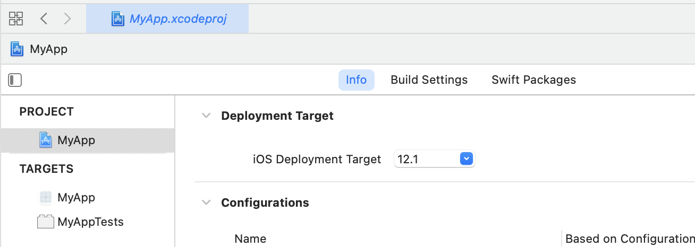
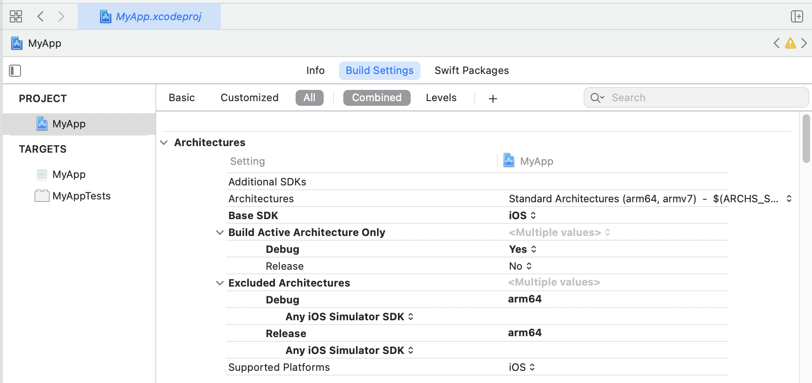
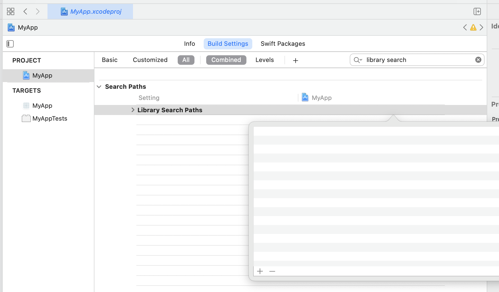
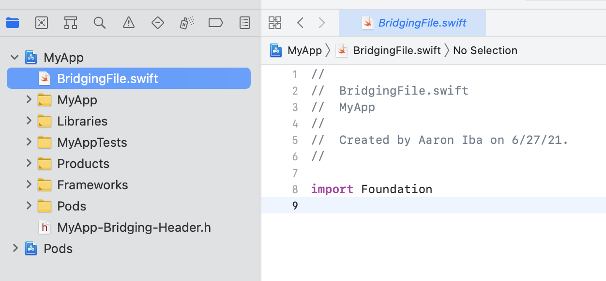

# react-native 0.64.2 with Apple M1 and xcode 12.5

This is how I got react-native to compile on Apple Silicon without rosetta.

## Clean Caches

```bash
$ pod cache clean --all
$ yarn cache clean
$ rm -rf ~/Library/Developer/Xcode/DerivedData/*
```

## Create Project

```bash
$ npx react-native@0.64.2 init MyApp
$ cd MyApp
$ open ios/MyApp.xcworkspace
```

## Configure XCode

(Make sure to be working in the `.xcworkspace` not the `.xcodeproj`)

### MyApp -> Info -> iOS Deployment Target: set to 12.1

<kbd>

### MyApp -> Build Settings -> Architectures -> Excluded Architectures: set to arm64

<kbd>

### MyApp -> Build Settings -> Library Search Paths: remove all of them.

Should look like this when you're done:

<kbd>

### Next create an empty "BridgingFile.swift" to get XCode to do swift bridging.

* File -> New -> File...
* Call it "BridgingFile.swift"
* Choose "Create Bridging Header"
* (File can remain empty)

<kbd>

## Now edit MyApp/ios/Podfile

Change the platform line to:
```ruby
platform :ios, '12.1'
```

Replace  `use_flipper!()` and `post_install` (lines 24-28) with:
```ruby
  use_flipper!({ 'Flipper' => '0.95.0', 'Flipper-Folly' => '2.6.7', 'Flipper-DoubleConversion' => '3.1.7' })
  post_install do |installer|
    installer.pods_project.build_configurations.each do |config|
      config.build_settings["EXCLUDED_ARCHS[sdk=iphonesimulator*]"] = "arm64"
      config.build_settings['IPHONEOS_DEPLOYMENT_TARGET'] = '12.1'
    end
    react_native_post_install(installer)
  end
```

## Rebuild Pods

```bash
$ cd ios
$ rm -rf Pods Podfile.lock
$ rm -rf ~/Library/Developer/Xcode/DerivedData/*
$ pod deintegrate && pod setup && pod install
```

The XCode Project should now compile and run.

## References:

- [https://gist.github.com/badsyntax/72c5c965fcaefe66d049a8c2cdf34198](https://www.notion.so/72c5c965fcaefe66d049a8c2cdf34198)
- [https://github.com/facebook/react-native/issues/31480](https://github.com/facebook/react-native/issues/31480)
- [https://github.com/facebook/react-native/issues/29605](https://github.com/facebook/react-native/issues/29605)
- [https://stackoverflow.com/questions/66369650/undefined-symbol-protocol-descriptor-for-swift-expressiblebyfloatliteral-issu](https://stackoverflow.com/questions/66369650/undefined-symbol-protocol-descriptor-for-swift-expressiblebyfloatliteral-issu)
- [https://stackoverflow.com/questions/63261150/yogakit-modulemap-not-found-after-running-the-ios-simulator](https://stackoverflow.com/questions/63261150/yogakit-modulemap-not-found-after-running-the-ios-simulator)
- [https://github.com/facebook/react-native/commit/4246c75d0d5b9dccbe0fd5ecec66b4cc0331f815](https://github.com/facebook/react-native/commit/4246c75d0d5b9dccbe0fd5ecec66b4cc0331f815)